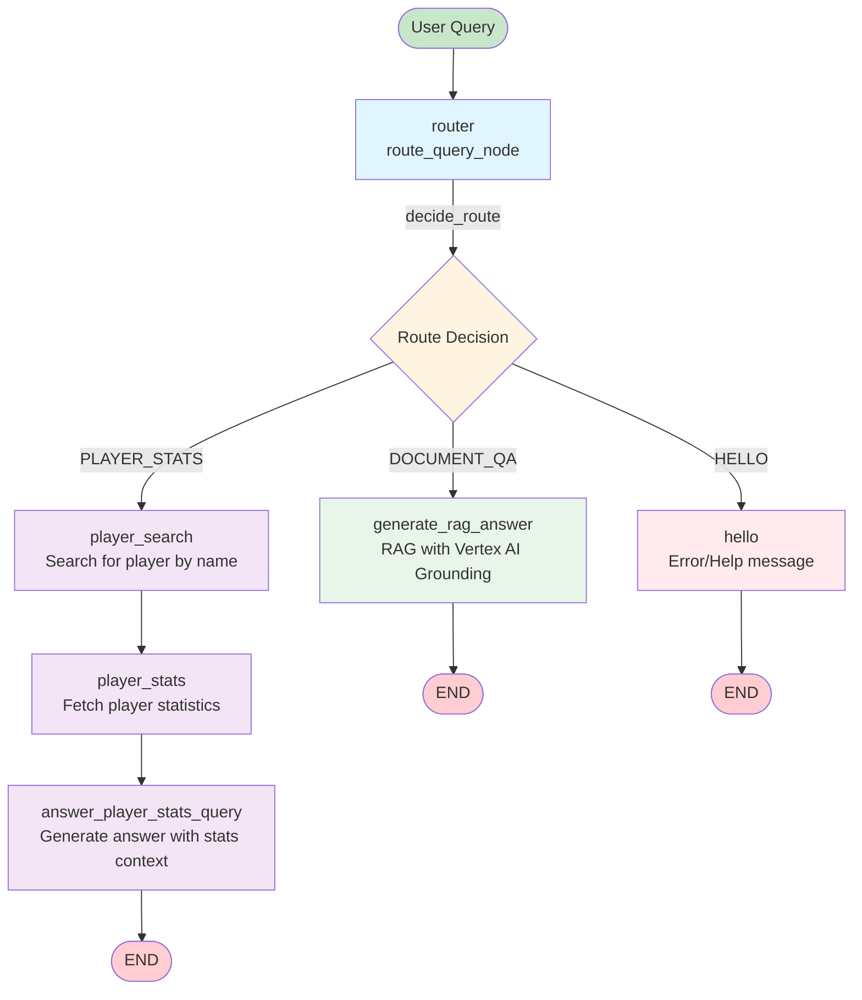

# MLB IRIS LangGraph Flow Diagram

This document contains a visual representation of the graph flow for the MLB assistant agent.

## Graph Flow

## Node Descriptions

### Entry Point
- **router** (`route_query_node`): Entry point that analyzes the user query using an LLM to determine routing and extract entities (player name, team). Returns route: `PLAYER_STATS`, `DOCUMENT_QA`, or `HELLO`.

### Routing Paths

#### 1. DOCUMENT_QA Path
- **generate_rag_answer** (`generate_rag_answer`): 
  - Uses Vertex AI native grounding with RAG corpus
  - Performs vector search, retrieves relevant chunks, and synthesizes answer
  - Adds inline citations and references
  - Includes retry logic (3 attempts with exponential backoff) for ResourceExhausted errors
  - Returns formatted answer with sources

#### 2. PLAYER_STATS Path
- **player_search** (`player_search_node`):
  - Uses extracted player name from router or regex fallback
  - Calls `search_player()` tool to find matching players
  - Selects best match (exact match > partial match > first result)
  - Updates state with `player_id`
  
- **player_stats** (`player_stats_node`):
  - Uses `player_id` from previous node
  - Calls `get_player_stats()` tool to fetch statistics
  - Extracts hitting season stats (AVG, OPS, HR, RBI)
  - Updates state with `stats` dictionary
  
- **answer_player_stats_query** (`answer_player_stats_query`):
  - Uses player stats as context
  - Constructs prompt with hitting statistics
  - Uses LLM to generate contextual answer
  - Returns formatted response

#### 3. HELLO Path (Error Handling)
- **hello** (`hello_node`):
  - Handles cases where routing failed or query couldn't be processed
  - Explains agent capabilities
  - Provides examples of supported queries
  - Returns helpful error message

## State Schema

The graph uses a `State` TypedDict with the following fields:

- `messages`: List of messages (conversation history)
- `player_id`: Integer or None (recovered player ID)
- `stats`: Dictionary or None (player statistics)
- `extracted_name`: String or None (LLM-extracted player name)
- `extracted_team`: String or None (LLM-extracted team name)
- `route`: String (`"PLAYER_STATS"`, `"DOCUMENT_QA"`, or `"HELLO"`)

## Flow Summary

1. **All queries start at the router** which performs intent classification and entity extraction
2. **Conditional routing** based on `decide_route()` function reads the `route` field from state
3. **Three possible paths**:
   - **Document Q&A**: Direct RAG generation with grounding and citations
   - **Player Stats**: Multi-step pipeline (search → fetch stats → generate answer)
   - **Hello**: Error handling with capability explanation
4. **All paths terminate at END** after generating a response message

